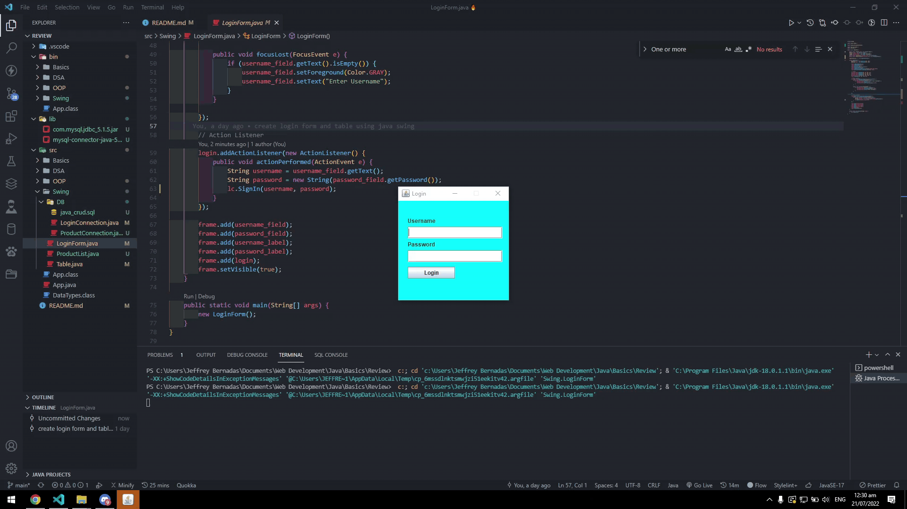
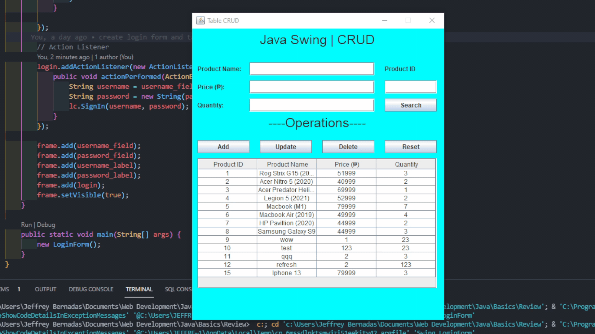
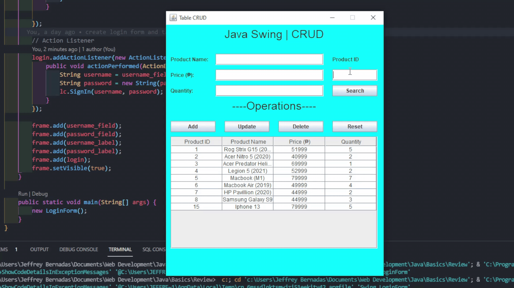

## My Java Review

Core Java Review

## Topics

<ul>
    <li>Basic Concepts (Done)</li>
    <li>Classes & Methods (Done)</li>
    <li>OOP (Done)</li>
    <li>GUI with Java Swing (Done)</li>
    <li>JDBC w/ MySQL (Done)</li>
    <li>Consuming Third Party APIs (TBD)</li>
    <li>Data Structures & Algorithms (TBD)</li>
</ul>

## Swing CRUD Project Details

<h4 align='center'>Login before table is accessed (username & password is 'admin')</h4>



<h4 align='center'>Add Product</h4>


<h4 align='center'>Search and Update Product by ID</h4>



<h4 align='center'>Delete Product by ID</h4>


<h4 align='center'>Reset Button for fields and tablet</h4>



## In case you want to use the Swing CRUD project

1. Download both jars inside lib folder in root directory and put it in your project's lib folder.
2. Import SQL db inside Swing/DB directory.
3. Inside Swing/DB directory, change port according to your DB port (the 3306).

```
Connection conn = (Connection) DriverManager.getConnection("jdbc:mysql://localhost:3306/java_crud?",
   "root", "");
```

4. Run your DB and this app.
